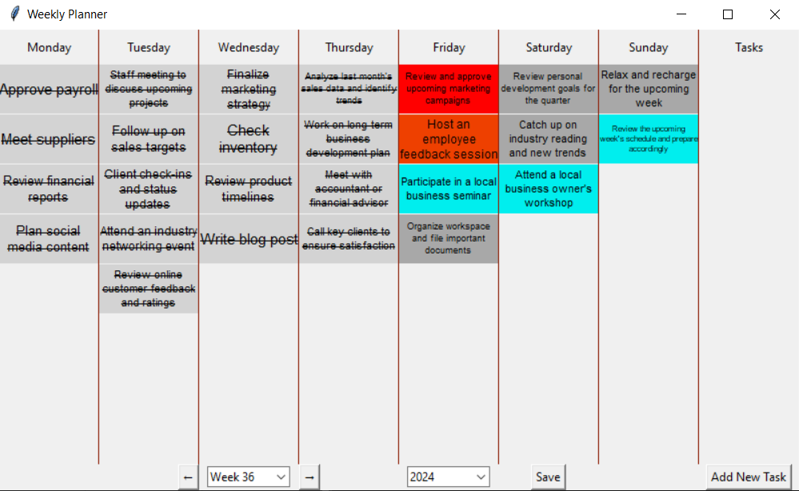

# Weekly Planner

This repository contains a weekly planner template designed to help business owners organize tasks efficiently. The planner divides tasks by day and urgency, ensuring a balanced approach to managing operations, meetings, and personal growth.



## Features

- **Task Organization**: Plan tasks for each day of the week.
- **Urgency Categorization**: Tasks are categorized as Urgent, High, Normal, or Low, allowing for priority management.
- **Weekly Overview**: Get a comprehensive view of weekly tasks at a glance.

## Usage

1. **Clone the Repository**:  
   Clone this repository to your local machine using:
   ```bash
   git clone https://github.com/your-username/weekly-planner.git
