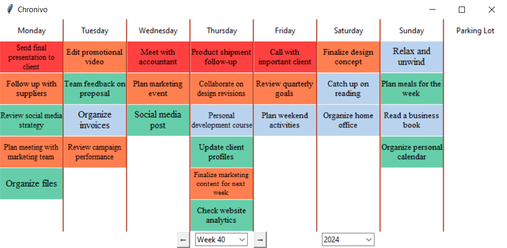

# Weekly Planner

This repository contains a weekly planner template designed to help everyone organize tasks efficiently. The planner divides tasks by day and urgency, ensuring a balanced approach to managing operations, meetings, and personal growth.



## Features

- **Task Organization**: Plan tasks for each day of the week.
- **Urgency Categorization**: Tasks are categorized as Urgent, High, Normal, or Low, allowing for priority management.
- **Weekly Overview**: Get a comprehensive view of weekly tasks at a glance.
- **Add New Tasks**: Add new tasks to tasks column and drag and drop them to desired day.
- **Current Week**: Planner opens with the current week.
- **Edit Task Name**: You can change task name by right click with "edit task".

## Usage

1. **Clone the Repository**:  
   Clone this repository to your local machine using:
   ```bash
   https://github.com/TayfunPektas/Planner.git

2. **Customize the Planner**:
   Modify the weekly planner template to fit your business needs. You can adjust tasks, urgency levels, and dates.

## Contributing

If you'd like to contribute to this project, feel free to open an issue or submit a pull request. Your ideas and improvements are welcome!


## Youtube Tutuorials

https://www.youtube.com/playlist?list=PLZAz6XqNmSZBn5ilIrJyY3gB9z-VRQKb_
